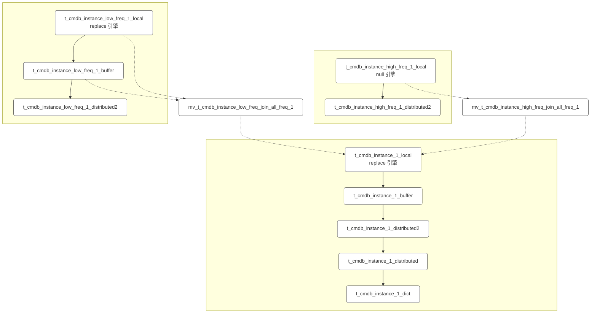
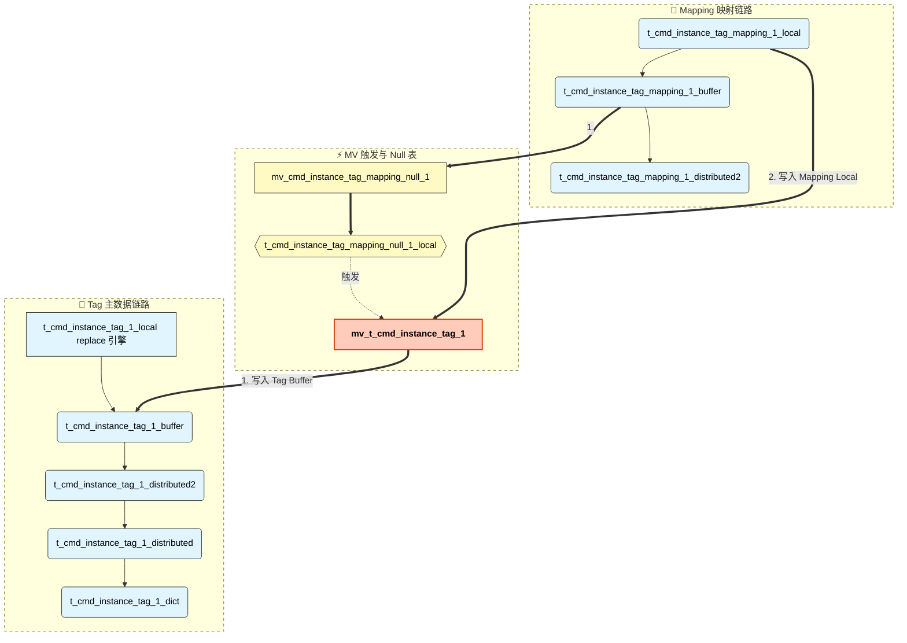
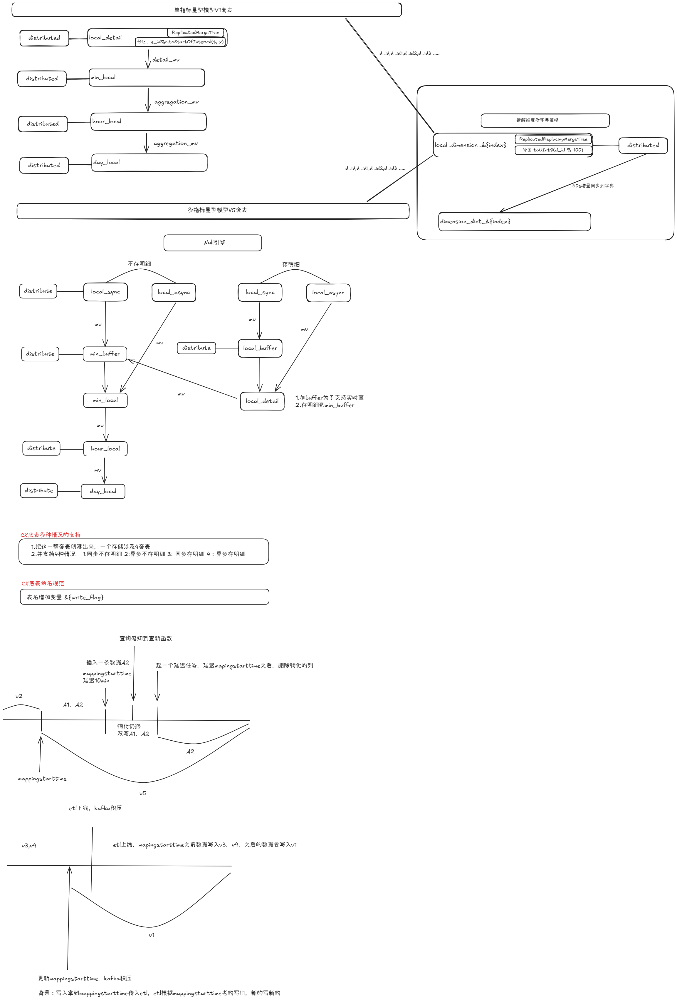

# 实体、实体实例、标签

## 实例标签表
```
CREATE TABLE IF NOT EXISTS one_entity_db.t_cmdb_tag_info_local
(
    `tag_key_id` Int64 COMMENT '标签key id',
    `tag_id` Int64 COMMENT '标签id',
    `tag_key` String COMMENT '标签key',
    `tag_value` String COMMENT '标签value',
    `tag_key_type` Int8 COMMENT '标签key类型 0：手动 1：自动',
    `tag_type` Int8 COMMENT '标签类型 0：共享 1：我的',
    `e_id` UInt16 COMMENT '环境id',
    `t` DateTime('Asia/Shanghai') COMMENT '数据实际时间',
    `send_ck_time` DateTime64(3, 'Asia/Shanghai') COMMENT '数据推送ck时间',
    `insert_time` DateTime('Asia/Shanghai') DEFAULT now() COMMENT '写入ck时间',
    `is_deleted` UInt8 COMMENT '0:未删除 1:已删除'
    ) ENGINE = ReplicatedReplacingMergeTree('{metadataaddr}:/clickhouse/tables/{uuid}/{shard}', '{replica}', send_ck_time, is_deleted)
    PARTITION BY toUInt8(tag_id % 5)
    ORDER BY (tag_id, tag_key_id)
    SETTINGS allow_experimental_replacing_merge_with_cleanup = 1,index_granularity = 8192
    ZEUS_SETTINGS zeus_topic='t_cmdb_tag_info';

CREATE TABLE IF NOT EXISTS one_entity_db.t_cmdb_tag_info_distributed2
(
    `tag_key_id` Int64,
    `tag_id` Int64,
    `tag_key` String,
    `tag_value` String,
    `tag_key_type` Int8,
    `tag_type` Int8,
    `e_id` UInt16,
    `t` DateTime('Asia/Shanghai'),
    `send_ck_time` DateTime64(3, 'Asia/Shanghai'),
    `insert_time` DateTime('Asia/Shanghai') DEFAULT now(),
    `is_deleted` UInt8
    )
    ENGINE = Distributed('cluster', 'one_entity_db', 't_cmdb_tag_info_local', intHash64(tag_id));

CREATE TABLE IF NOT EXISTS one_entity_db.t_cmdb_tag_info_distributed3
(
    `tag_key_id` Int64,
    `tag_id` Int64,
    `tag_key` String,
    `tag_value` String,
    `tag_key_type` Int8,
    `tag_type` Int8,
    `e_id` UInt16,
    `t` DateTime('Asia/Shanghai'),
    `send_ck_time` DateTime64(3, 'Asia/Shanghai'),
    `insert_time` DateTime('Asia/Shanghai') DEFAULT now(),
    `is_deleted` UInt8
    )
    ENGINE = Distributed('master_cluster', 'one_entity_db', 't_cmdb_tag_info_local', intHash64(tag_id));

CREATE TABLE IF NOT EXISTS one_entity_db.t_cmdb_tag_info_distributed
(
    `tag_key_id` Int64,
    `tag_id` Int64,
    `tag_key` String,
    `tag_value` String,
    `tag_key_type` Int8,
    `tag_type` Int8,
    `e_id` UInt16,
    `t` DateTime('Asia/Shanghai'),
    `send_ck_time` DateTime64(3, 'Asia/Shanghai'),
    `insert_time` DateTime('Asia/Shanghai') DEFAULT now(),
    `is_deleted` UInt8
    )
    ENGINE = Distributed('all_distributed_clusters', 'one_entity_db', 't_cmdb_tag_info_distributed2', intHash64(tag_id));

CREATE DICTIONARY IF NOT EXISTS one_entity_db.t_cmdb_tag_info_dict
(
    `tag_id` Int64,
    `tag_info` String,
    `is_deleted` UInt8
)
PRIMARY KEY tag_id
SOURCE(CLICKHOUSE(
    DB 'one_entity_db'
    QUERY '
        SELECT
            tag_id,
            toJSONString(
                map(
                    ''tag_id'', toString(tag_id),
                    ''tag_key'', tag_key,
                    ''tag_value'', tag_value,
                    ''tag_key_type'', toString(tag_key_type),
                    ''tag_type'', toString(tag_type),
                    ''e_id'', toString(e_id)
                )
            ) AS tag_info,
            is_deleted
        FROM one_entity_db.t_cmdb_tag_info_distributed FINAL WHERE {condition} settings allow_experimental_replacingmergetree_buffer_final=0
    '
    UPDATE_FIELD insert_time
    UPDATE_LAG 60
))
LIFETIME(MIN 20 MAX 40)
LAYOUT(HASHED(MAX_LOAD_FACTOR 0.95));


```
* 业务上是存在标签key改名，标签改名的场景的，这样设计能保证CK侧动作最小；


##  实体 实例


### 设计说明
* 预置实体有160多种，并且可以自定义实体，数量不可控；
    * 遂整体设定10套CK表，meta服务管理好映射关系
    * 实例数据写入，通过分布式表写入，并且按着实例ID做hash，保证相同ID落到同一个shard中；
    * 该过程中，物化与字典实时更新是比较消耗CPU的，综合权衡，字典更新周期为20-40秒增量更新一次；
    * 这部分涉及数据变更，都采用的是replacingMergeTree引擎，要求写入时要写入完整的属性信息，不可缺失。
* 实例数据有高频属性与低频属性
    * 低频属性主要是根据实例注册更新触发；
    * 高频属性主要是用来感知实例是否活跃，分为自动感知与业务方主动推送
    * 不管是哪个渠道过来的数据，最终都要体现在完整的实例信息上；
    * 低频数据全量留存，高频数据为null引擎，不做数据留存，直接物化到要存储的表即可；

* 实例数据的写入，严格意义上是业务侧通过请求触发的。
    * 同步请求后，数据要推送CK，但是CK会由于各种情况，产生反压；
    * 遂实例注册更新链路中，数据写入到CK走的是异步kafka方式；
    * 在reload等场景下，数据是走的直连consumer方式写入CK;
* 实例数据是异步写入CK的，字典更新也需要有一个时间来感知；
    * 数据真正的新旧，肯定是业务侧打的更新时间；
    * 存在旧数据后写入的情况，遂引入了insert_ck_time，为业务侧打上的时间戳，该属性新拿数据就是新的。
    * 字典更新时，使用的是存储后的数据的updata_time，就可以规避数据偏差或者遗漏的情况；
* 实例数据是动态的，时刻会变动的，变动的涉及条数与属性值，最终会超出预期；
    * 针对实体实例，增加了机制：部分属性不做CK下推，以降低对CK的内存消耗，提升数据价值；
    * 后续该机制应扩展为标准能力，由模型进行驱动管理；
    * 针对部分实体实例的生命周期做了调配，同样是为了降低内存占用；
* 分布式表由distributed/distributed2/distributed3三套；
    * distributed含义不变，仍然是全局的分布式表，查询侧使用的表，每个中心的节点划分为一个shard；
    * distributed2，本中心的shard集群，主要是用来查询本中心内数据，不涉及跨中心数据的查询；
    * distributed3，主中心的shard集群，之所以有该集群，是因为实体实例 + 标签信息，涉及多中心的写入，但是实例数据原则上只在主中心存储与管理，所以这部分数据都要最终写到主中心，遂该集群为写入集群，不承担查询请求。


```sql
CREATE TABLE  IF NOT EXISTS one_entity_db.t_cmdb_instance_1_local ( `instance_id` Int64 COMMENT 'id', `model_key` String COMMENT '实体模型key', `e_id` UInt16 COMMENT '环境id', `v` JSON COMMENT '实例信息', `t` DateTime('Asia/Shanghai') COMMENT '数据实际时间', `send_ck_time` DateTime64(3, 'Asia/Shanghai') COMMENT '数据推送ck时间', `insert_time` DateTime('Asia/Shanghai') DEFAULT now() COMMENT '写入ck时间', `is_deleted` UInt8 COMMENT '0:未删除 1:已删除' )ENGINE = ReplicatedReplacingMergeTree('{metadataaddr}:/clickhouse/tables/{uuid}/{shard}', '{replica}',send_ck_time,is_deleted) PARTITION BY toUInt8(instance_id % 10) ORDER BY (instance_id,e_id,model_key) SETTINGS database_replicated_allow_replicated_engine_arguments=true,allow_experimental_replacing_merge_with_cleanup = 1,index_granularity = 8192 ZEUS_SETTINGS zeus_topic='t_cmdb_instance_1';
CREATE TABLE IF NOT EXISTS one_entity_db.t_cmdb_instance_1_buffer ENGINE = Buffer('one_entity_db','t_cmdb_instance_1_local', 1, 60, 120, 50000, 500000, 20971520, 104857600);
CREATE TABLE IF NOT EXISTS one_entity_db.t_cmdb_instance_1_distributed2 as one_entity_db.t_cmdb_instance_1_local ENGINE = Distributed('cluster', 'one_entity_db', 't_cmdb_instance_1_buffer', intHash64(instance_id)) SETTINGS prefer_localhost_replica=false, load_balancing_first_offset=0, load_balancing='first_or_random';
CREATE TABLE IF NOT EXISTS one_entity_db.t_cmdb_instance_1_distributed3 as one_entity_db.t_cmdb_instance_1_local ENGINE = Distributed('master_cluster', 'one_entity_db', 't_cmdb_instance_1_buffer', intHash64(instance_id)) SETTINGS prefer_localhost_replica=false, load_balancing_first_offset=1, load_balancing='first_or_random';
CREATE TABLE IF NOT EXISTS one_entity_db.t_cmdb_instance_1_distributed as one_entity_db.t_cmdb_instance_1_local ENGINE = Distributed('all_distributed_clusters', 'one_entity_db', 't_cmdb_instance_1_distributed2', intHash64(instance_id));
CREATE DICTIONARY IF NOT EXISTS one_entity_db.t_cmdb_instance_1_dict ( `instance_id` Int64, `model_key` String, `e_id` UInt16, `v` String, `t` DateTime('Asia/Shanghai') ) PRIMARY KEY instance_id,model_key,e_id SOURCE(CLICKHOUSE( DB 'one_entity_db' query 'SELECT instance_id,model_key,e_id,toJSONString(v) as v,t from one_entity_db.t_cmdb_instance_1_distributed FINAL WHERE {condition} settings allow_experimental_replacingmergetree_buffer_final=0' update_field 'insert_time' update_lag 60)) LIFETIME(MIN 20 MAX 40) LAYOUT(HASHED(MAX_LOAD_FACTOR 0.95));
CREATE TABLE IF NOT EXISTS one_entity_db.t_cmdb_instance_tag_1_local ( `instance_id` Int64 COMMENT '实例id', `model_key` String COMMENT 'modelKey', `e_id` UInt16 COMMENT '环境id', `tags` Map(LowCardinality(Int64), String) COMMENT '标签Map key:tagId,value:标签值', `t` DateTime('Asia/Shanghai') COMMENT '数据实际时间', `send_ck_time` DateTime64(3, 'Asia/Shanghai') COMMENT '数据推送ck时间', `insert_time` DateTime('Asia/Shanghai') DEFAULT now() COMMENT '写入ck时间', `is_deleted` UInt8 COMMENT '0:未删除 1:已删除', INDEX tags_key_index mapKeys(tags) type bloom_filter GRANULARITY 1 )ENGINE = ReplicatedReplacingMergeTree('{metadataaddr}:/clickhouse/tables/{uuid}/{shard}','{replica}',send_ck_time,is_deleted) PARTITION BY toUInt8(instance_id % 10) ORDER BY (instance_id,e_id,model_key) SETTINGS database_replicated_allow_replicated_engine_arguments=true,allow_experimental_replacing_merge_with_cleanup = 1,index_granularity = 8192 ZEUS_SETTINGS zeus_topic='t_cmdb_instance_tag_1';
CREATE TABLE IF NOT EXISTS one_entity_db.t_cmdb_instance_tag_mapping_1_local ( `model_key` String COMMENT 'modelKey', `tag_id` Int64 COMMENT '标签id', `instance_id` Int64 COMMENT '实例id', `e_id` UInt16 COMMENT '环境id', `t` DateTime('Asia/Shanghai') COMMENT '数据实际时间', `send_ck_time` DateTime64(3, 'Asia/Shanghai') COMMENT '数据推送ck时间', `insert_time` DateTime('Asia/Shanghai') DEFAULT now() COMMENT '写入ck时间', `data_source` UInt8 COMMENT '数据来源 0:手动绑定 1:定时标签规则', `is_deleted` UInt8 COMMENT '0:未删除 1:已删除', INDEX tag_id_bf_idx tag_id TYPE bloom_filter GRANULARITY 1 ) ENGINE = ReplicatedReplacingMergeTree('{metadataaddr}:/clickhouse/tables/{uuid}/{shard}', '{replica}', send_ck_time, is_deleted) PARTITION BY toUInt8(instance_id % 10) ORDER BY (instance_id,tag_id,model_key,e_id) SETTINGS allow_experimental_replacing_merge_with_cleanup = 1,index_granularity = 8192 ZEUS_SETTINGS zeus_topic='t_cmdb_instance_tag_mapping_1';
CREATE TABLE IF NOT EXISTS one_entity_db.t_cmdb_instance_tag_mapping_1_buffer ENGINE = Buffer('one_entity_db','t_cmdb_instance_tag_mapping_1_local', 1, 30, 60, 10000, 100000, 20971520, 104857600);
CREATE TABLE IF NOT EXISTS one_entity_db.t_cmdb_instance_tag_mapping_null_1_local ( `model_key` String COMMENT 'modelKey', `tag_id` Int64 COMMENT '标签id', `instance_id` Int64 COMMENT '实例id', `e_id` UInt16 COMMENT '环境id', `t` DateTime('Asia/Shanghai') COMMENT '数据实际时间', `send_ck_time` DateTime64(3, 'Asia/Shanghai') COMMENT '数据推送ck时间', `insert_time` DateTime('Asia/Shanghai') DEFAULT now() COMMENT '写入ck时间', `data_source` UInt8 COMMENT '数据来源 0:手动绑定 1:定时标签规则', `is_deleted` UInt8 COMMENT '0:未删除 1:已删除' ) ENGINE = `Null`;
CREATE MATERIALIZED VIEW IF NOT EXISTS one_entity_db.mv_cmdb_instance_tag_mapping_null_1 TO one_entity_db.t_cmdb_instance_tag_mapping_null_1_local as SELECT model_key,tag_id,instance_id,e_id,t,send_ck_time,insert_time,data_source,is_deleted FROM one_entity_db.t_cmdb_instance_tag_mapping_1_buffer;
CREATE TABLE IF NOT EXISTS one_entity_db.t_cmdb_instance_tag_mapping_1_distributed2 as one_entity_db.t_cmdb_instance_tag_mapping_1_local ENGINE = Distributed('cluster', 'one_entity_db', 't_cmdb_instance_tag_mapping_1_buffer', intHash64(instance_id));
CREATE TABLE IF NOT EXISTS one_entity_db.t_cmdb_instance_tag_mapping_1_distributed3 as one_entity_db.t_cmdb_instance_tag_mapping_1_local ENGINE = Distributed('master_cluster', 'one_entity_db', 't_cmdb_instance_tag_mapping_1_buffer', intHash64(instance_id));
CREATE MATERIALIZED VIEW IF NOT EXISTS one_entity_db.mv_t_cmdb_instance_tag_1 TO one_entity_db.t_cmdb_instance_tag_1_local AS WITH change_tag_info AS ( SELECT * FROM one_entity_db.t_cmdb_instance_tag_mapping_null_1_local WHERE data_source = 0 ), change_instance_info AS ( SELECT DISTINCT model_key,instance_id,e_id FROM change_tag_info ) SELECT s.model_key, s.instance_id, s.e_id, CAST((groupArrayIf(a.tag_id, a.last_is_deleted = 0),arrayMap(x -> '', groupArrayIf(a.tag_id, a.last_is_deleted = 0))),'Map(Int64, String)') AS tags, now() AS t, now64() as send_ck_time, now() AS insert_time, IF(countIf(a.last_is_deleted = 0) = 0, 1, 0) AS is_deleted FROM change_instance_info AS s LEFT JOIN ( SELECT h.model_key, h.instance_id, h.e_id, h.tag_id, argMax(h.is_deleted, h.send_ck_time) AS last_is_deleted FROM ( SELECT model_key, instance_id, e_id, tag_id, send_ck_time, is_deleted FROM one_entity_db.t_cmdb_instance_tag_mapping_1_buffer WHERE (instance_id, model_key, e_id) IN (SELECT instance_id, model_key, e_id FROM change_instance_info) UNION ALL SELECT model_key, instance_id, e_id, tag_id, send_ck_time, is_deleted FROM change_tag_info ) AS h GROUP BY h.model_key, h.instance_id, h.e_id, h.tag_id ) AS a ON s.model_key = a.model_key AND s.instance_id = a.instance_id AND s.e_id = a.e_id GROUP BY s.model_key, s.instance_id, s.e_id;
CREATE TABLE IF NOT EXISTS one_entity_db.t_cmdb_instance_tag_1_buffer ENGINE = Buffer('one_entity_db','t_cmdb_instance_tag_1_local', 1, 60, 120, 50000, 500000, 20971520, 104857600);
CREATE TABLE IF NOT EXISTS one_entity_db.t_cmdb_instance_tag_1_distributed2 as one_entity_db.t_cmdb_instance_tag_1_local ENGINE = Distributed('cluster', 'one_entity_db', 't_cmdb_instance_tag_1_buffer', intHash64(instance_id)) SETTINGS prefer_localhost_replica=false, load_balancing_first_offset=1, load_balancing='first_or_random';
CREATE TABLE IF NOT EXISTS one_entity_db.t_cmdb_instance_tag_1_distributed3 as one_entity_db.t_cmdb_instance_tag_1_local ENGINE = Distributed('master_cluster', 'one_entity_db', 't_cmdb_instance_tag_1_buffer', intHash64(instance_id)) SETTINGS prefer_localhost_replica=false, load_balancing_first_offset=1, load_balancing='first_or_random';
CREATE TABLE IF NOT EXISTS one_entity_db.t_cmdb_instance_tag_1_distributed as one_entity_db.t_cmdb_instance_tag_1_local ENGINE = Distributed('all_distributed_clusters', 'one_entity_db', 't_cmdb_instance_tag_1_distributed2', intHash64(instance_id));
CREATE DICTIONARY IF NOT EXISTS one_entity_db.t_cmdb_instance_tag_1_dict ( `instance_id` Int64, `model_key` String, `e_id` UInt16, `tags` String, `t` DateTime('Asia/Shanghai') ) PRIMARY KEY instance_id,model_key,e_id SOURCE(CLICKHOUSE( DB 'one_entity_db' query 'SELECT instance_id,model_key,e_id,toJSONString(tags) as tags,t from one_entity_db.t_cmdb_instance_tag_1_distributed FINAL WHERE {condition} settings allow_experimental_replacingmergetree_buffer_final=0' update_field 'insert_time' update_lag 60)) LIFETIME(MIN 20 MAX 40) LAYOUT(HASHED(MAX_LOAD_FACTOR 0.95));
CREATE TABLE IF NOT EXISTS one_entity_db.t_cmdb_instance_low_freq_1_local ( `instance_id` Int64 COMMENT 'id', `model_key` String COMMENT '实体模型key', `e_id` UInt16 COMMENT '环境id', `v` JSON COMMENT '实例信息', `t` DateTime('Asia/Shanghai') COMMENT '数据实际时间', `send_ck_time` DateTime64(3, 'Asia/Shanghai') COMMENT '数据推送ck时间', `insert_time` DateTime('Asia/Shanghai') DEFAULT now() COMMENT '写入ck时间', `is_deleted` UInt8 COMMENT '0:未删除 1:已删除' )ENGINE = ReplicatedReplacingMergeTree('{metadataaddr}:/clickhouse/tables/{uuid}/{shard}', '{replica}',send_ck_time,is_deleted) PARTITION BY toUInt8(instance_id % 10) ORDER BY (instance_id,e_id,model_key) SETTINGS database_replicated_allow_replicated_engine_arguments=true,allow_experimental_replacing_merge_with_cleanup = 1,index_granularity = 8192 ZEUS_SETTINGS zeus_topic='t_cmdb_instance_low_freq_1';
CREATE TABLE IF NOT EXISTS one_entity_db.t_cmdb_instance_low_freq_1_buffer ENGINE = Buffer('one_entity_db','t_cmdb_instance_low_freq_1_local', 1, 30, 60, 10000, 100000, 20971520, 104857600);
CREATE TABLE IF NOT EXISTS one_entity_db.t_cmdb_instance_low_freq_1_distributed2 as one_entity_db.t_cmdb_instance_low_freq_1_local ENGINE = Distributed('cluster', 'one_entity_db', 't_cmdb_instance_low_freq_1_buffer', intHash64(instance_id));
CREATE TABLE IF NOT EXISTS one_entity_db.t_cmdb_instance_low_freq_1_distributed3 as one_entity_db.t_cmdb_instance_low_freq_1_local ENGINE = Distributed('master_cluster', 'one_entity_db', 't_cmdb_instance_low_freq_1_buffer', intHash64(instance_id));
CREATE TABLE  IF NOT EXISTS one_entity_db.t_cmdb_instance_high_freq_1_local ( `instance_id` Int64 COMMENT 'id', `model_key` String COMMENT '实体模型key', `e_id` UInt16 COMMENT '环境id', `v` JSON COMMENT '实例信息', `t` DateTime('Asia/Shanghai') COMMENT '数据实际时间', `send_ck_time` DateTime64(3, 'Asia/Shanghai') COMMENT '数据推送ck时间', `insert_time` DateTime('Asia/Shanghai') DEFAULT now() COMMENT '写入ck时间', `is_deleted` UInt8 )ENGINE = Null ZEUS_SETTINGS zeus_topic='t_cmdb_instance_high_freq_1';
CREATE TABLE IF NOT EXISTS one_entity_db.t_cmdb_instance_high_freq_1_distributed2 as one_entity_db.t_cmdb_instance_high_freq_1_local ENGINE = Distributed('cluster', 'one_entity_db', 't_cmdb_instance_high_freq_1_local', intHash64(instance_id));
CREATE TABLE IF NOT EXISTS one_entity_db.t_cmdb_instance_high_freq_1_distributed3 as one_entity_db.t_cmdb_instance_high_freq_1_local ENGINE = Distributed('master_cluster', 'one_entity_db', 't_cmdb_instance_high_freq_1_local', intHash64(instance_id));
CREATE MATERIALIZED VIEW IF NOT EXISTS one_entity_db.mv_t_cmdb_instance_high_freq_join_low_freq_1 TO one_entity_db.t_cmdb_instance_1_local AS WITH high_freq_batch AS ( SELECT instance_id, model_key, e_id, toJSONString(v) AS v_high, t, send_ck_time, insert_time, is_deleted FROM one_entity_db.t_cmdb_instance_high_freq_1_local ), low_freq_data AS ( SELECT instance_id, model_key, e_id, argMax(toJSONString(v), send_ck_time) AS v_low, argMax(t, send_ck_time) AS t_low, argMax(send_ck_time, send_ck_time) AS t_send_ck_time, argMax(is_deleted, send_ck_time) AS is_deleted_low FROM one_entity_db.t_cmdb_instance_low_freq_1_buffer WHERE instance_id IN (SELECT instance_id FROM high_freq_batch) AND is_deleted = 0 GROUP BY instance_id, model_key, e_id ) SELECT h.instance_id, h.model_key, h.e_id, CAST( JSONMergePatch( l.v_low, h.v_high), 'JSON' )  AS v, l.t_low AS t, h.send_ck_time AS send_ck_time, l.is_deleted_low AS is_deleted FROM high_freq_batch AS h INNER JOIN low_freq_data AS l ON h.instance_id = l.instance_id AND h.e_id = l.e_id AND h.model_key = l.model_key;
CREATE MATERIALIZED VIEW IF NOT EXISTS one_entity_db.mv_t_cmdb_instance_low_freq_join_all_freq_1 TO one_entity_db.t_cmdb_instance_1_local AS WITH low_freq_batch AS ( SELECT instance_id, model_key, e_id, toJSONString(v) AS v_low, t, send_ck_time, is_deleted FROM one_entity_db.t_cmdb_instance_low_freq_1_buffer ), all_freq AS ( SELECT instance_id, model_key, e_id, argMax(toJSONString(v), send_ck_time) AS v_all, argMax(t, send_ck_time) AS t_all, argMax(send_ck_time, send_ck_time) AS send_ck_time_all, argMax(is_deleted, send_ck_time) AS is_deleted_all FROM one_entity_db.t_cmdb_instance_1_local WHERE instance_id IN (SELECT instance_id FROM low_freq_batch) AND is_deleted = 0 GROUP BY instance_id, model_key, e_id ) SELECT l.instance_id, l.model_key, l.e_id, CAST( JSONMergePatch( l.v_low, if( JSONHas(toString(m.v_all), 'lastMonitorTime') AND JSONExtractRaw(toString(m.v_all), 'lastMonitorTime') != 'null', concat('{"lastMonitorTime":', JSONExtractRaw(toString(m.v_all), 'lastMonitorTime'), '}'), '{}' ), if( JSONHas(toString(m.v_all), 'lastUploadTime') AND JSONExtractRaw(toString(m.v_all), 'lastUploadTime') != 'null', concat('{"lastUploadTime":', JSONExtractRaw(toString(m.v_all), 'lastUploadTime'), '}'), '{}' ) ) AS JSON ) AS v, l.t AS t, l.send_ck_time as send_ck_time, l.is_deleted AS is_deleted FROM low_freq_batch AS l LEFT JOIN all_freq AS m ON l.instance_id = m.instance_id AND l.e_id = m.e_id AND l.model_key = m.model_key;
```


## 标签部分


* 标签信息也是涉及更新的，这部分表都是使用的replacingmergeTree引擎；
    * 信息做了纯粹的拆解，一行数据就是在数据发生变更时拿到的全部信息，比如mapping表，就是某实例打了或者摘了哪个标签；
* 标签信息有两部分来源：自定标签与手动标签；
    * 自动标签，在给实例打标签时，**可以拿到该实例的全部标签**，遂直接写到标签实例表中，不用通过物化完成数据的整合；
    * 手动标签，在给实例打标签时，**不能拿到该实例的全部标签**，遂，需通过物化，拿到该实例的全部标签信息在写入到实例标签表；


## v1套表


* 维度
    * 默认拆分为4个维度表，新注册的维度按着dimension_id做hash，保证相同的维度落到同一个维度表中，尽量保证能有效归并；
    * 实例ID以及实体下推属性，都默认存到明细表的json维度中；
    * 针对维度表的数据量，会根据去重数量做探测，超限之后会将某维度识别为高基数，调整到json列中；
    * 维度数据原则上只需要写一份，在titanclient中会有缓存，但是重启之后，会重新生成一遍；
    * 维度表都是replacingMergeTree引擎，支持覆写，写入都是写入的分布式2表，尽量将维度数据存储量保持在较低水平；

* 粒度表都是可配置的，受meta服务的TTL以及粒度配置管控；
    * 不同的粒度表为了控制分区数，跟ttl有一个联动；
    * 大粒度的表TTl不能比小粒度的时间段；
* 同步写与异步写
    * 这个作为meta服务的配置项，用来控制数据入库链路；